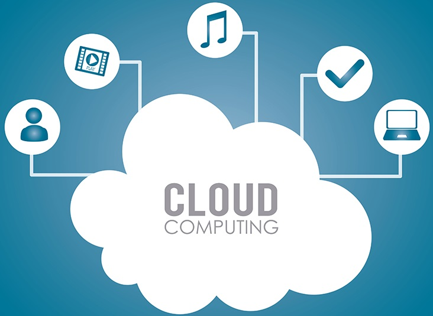
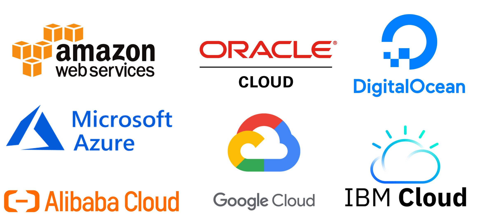

# 🤖**Reto semana uno IA Innovacción Virtual**☁️

## ÍNDICE

-  [ ] [👾 La nube, ¿Qué, cuándo y cómo?.](#-La-nube-qué-cuándo-y-cómo)
-  [ ] [👾 Servicios de nube.](#-Servicios-de-nube)
-  [ ] [👾 Ventajas y desventajas de la nube.](#-Ventajas-y-desventajas-de-la-nube)
-  [ ] [👾 Tipos de servicio.](#-Tipos-de-servicio)
-  [ ] [👾 Empresas que usan servicios en la nube.](#-Empresas-que-usan-servicios-en-la-nube)
-  [ ] [👾 Modelos de servicio en la nube.](#-Modelos-de-servicio-en-la-nube)

## 👾 La nube, ¿Qué, cuándo y cómo?

La definición de la nube puede parecer poco clara, pero, básicamente, es un término que se utiliza para describir una red mundial de servidores, cada uno con una función única. La nube no es una entidad física, sino una red enorme de servidores remotos de todo el mundo que están conectados para funcionar como un único ecosistema. Estos servidores están diseñados para almacenar y administrar datos, ejecutar aplicaciones o entregar contenido o servicios, como streaming de vídeos, correo web, software de ofimática o medios sociales. En lugar de acceder a archivos y datos desde un equipo personal o local, accede a ellos en línea desde cualquier dispositivo conectado a Internet, es decir, la información está disponible dondequiera que vaya y siempre que la necesite.
Las empresas utilizan cuatro métodos diferentes para implementar recursos en la nube. Hay una nube pública, que comparte recursos y ofrece servicios al público a través de Internet; una nube privada, que no se comparte y ofrece servicios a través de una red interna privada, normalmente hospedada en el entorno local; una nube híbrida, que comparte servicios entre nubes públicas y privadas, según su finalidad; y una nube comunitaria, que comparte recursos solo entre organizaciones, por ejemplo, con instituciones gubernamentales.

Tienes que olvidarte del disco duro. Cuando almacenas datos o ejecutas programas desde el disco duro, estás usando el almacenamiento local donde todo lo que necesita está físicamente cerca tuyo, de manera que puedes acceder a tus datos rápida y fácilmente. La industria de la informática funcionó durante décadas trabajando desde el disco duro. Para algunos, este sistema sigue siendo superior a la nube.

El sistema de almacenamiento en la nube no consiste en tener un hardware o servidor dedicado de almacenamiento conectado a la red (NAS) en la residencia. Almacenar datos en una red doméstica o de oficina es algo distinto a utilizar la nube. Hablamos de nube o «cloud computing», cuando accedemos a datos o programas a través de Internet, o al menos, tener esos datos sincronizados con otra información a través de la Web.

### **Como se creó la nube.**

Para entender el funcionamiento de la nube, −su arquitectura− merece la pena pensar en este sistema como dos partes separadas, el frontend y el backend. Ambas partes necesitan trabajar en sinergia dentro de Internet.
En el frontend se sitúa el ordenador o la red de ordenadores del usuario y el programa que usa para acceder a la nube. Cuando se trata de los correos electrónicos es fácil acceder, porque basta con un navegador de Internet, tipo Google Chrome, Internet Explorer o Mozilla. En otros casos, sin embargo, sí que es necesario contar con una aplicación especializada para poder acceder.
En el backend, en cambio, tenemos los ordenadores, servidores y sistemas de almacenamiento de datos que conforman la nube; cada aplicación suele contar con su propio servidor. Un servidor se encarga de controlar y administrar el tráfico para que la demanda de los clientes quede satisfecha. Por último, para asegurar que los datos siempre estarán accesibles, los sistemas de computación en nube tienen al menos el doble de los dispositivos necesarios para almacenarlos y realizan copias de seguridad en diferentes lugares.

### **¿Cuando se creó la nube?**

Para localizar los inicios de la nube hemos de remontarnos a la prehistoria de Internet. Pese a que este concepto nación en 1990, algunos pioneros de la computación anticiparon el destino de las redes computacionales en la década de los 60. J.C.R. Liclkider, que participó en el desarrollo de ARPANET, −red de computadoras creada por encargo del Departamento de Defensa de los Estados Unidos−, y John McCarthy, padre del término Inteligencia Artificial, fueron dos de los principales previsores de lo que se convertiría en la nube.
Licklider trazó las primeras ideas de una red computacional global allá por 1962, en discusiones sobre el concepto de ‘Red Computacional Intergaláctica’. Estas ideas contenían gran parte del sustrato de lo que hoy conocemos como Internet. El estadounidense describió en diversos documentos algunas aplicaciones en la red, y predijo el uso de las redes para soportar comunidades de intereses comunes sin importar la ubicación de sus usuarios. Por su parte, MacCarthy opinaba lo siguiente: “La computación algún día estará organizada como un servicio público, así como la luz o el agua”.
Ese es el germen, pero la aplicación de la nube tal y como la conocemos hoy comenzó en los años 80, cuando algunas tareas empezaron a tomar cuerpo en una red de computadoras en lugar de hacerlo en un único computador. De esta manera, la tarea se reparte entre varias máquinas, exigiendo menos del sistema para entregar el servicio a los usuarios.
De este modo, el término empezó a usarse para aludir primero a las redes telefónicas, como una manera de referirse a algo de lo que el usuario no necesita preocuparse, para después trasladarse a la infraestructura computacional. Aquí, la palabra “nube” fue empleada por primera vez dentro del entorno académico en 1997 por el profesor Ramnath Chellappa, quien lo definió como “un nuevo paradigma de computación”. Después, en 1999, la compañía Salesforce fue la primera en introducir el término “software como servicio”, entregando aplicaciones para empresas a través de un sitio web.

### **Dónde empezó la nube**

El símbolo de la nube se utilizó por primera vez en Estados Unidos, concretamente en el sistema ARPANET. Como hemos anticipado antes, este sistema es el precedente más claro de Internet, y consistía en una red de ordenadores creada por encargo del Departamento de Defensa de los Estados Unidos entre las diferentes instituciones académicas y estatales.

### **Por qué se creó la nube.**

Por puro progreso. El Cloud Computing es conectividad, flexibilidad, ligereza. Es un concepto revolucionario que permite que el mundo avance, que lo haga dejando a un lado el ruido y el humo de las máquinas. La nube hoy lo es todo. Y aunque no lo sepas: tú también estás en la nube.

## 👾 Servicios de nube

### -Amazon WS ☁️:

Amazon Web Services proporciona una plataforma de infraestructura escalable, de confianza y de bajo costo en la nube que impulsa cientos de miles de negocios de 190 países de todo el mundo. Con centros de datos en Estados Unidos, Europa, Brasil, Singapur, Japón y Australia.
[Saber mas de Amazon WS...](https://aws.amazon.com/es/)

### -Azure ☁️:

La nube de Microsoft se presenta como una solución para el campo empresarial que requiere trasladar toda su información tecnológica (sistemas, aplicaciones y software) a la nube, espacios virtuales donde pueden disponer de sus herramientas (con conexión a internet) sin ningún inconveniente.

Microsoft Azure ayuda en la optimización de la gestión de trabajo para implementar y administrar aplicaciones, así como almacenar y analizar bases de datos ágil y eficientemente.
[Saber mas de Azure...](https://azure.microsoft.com/es-mx/free/)

### -Google cloud ☁️:

Google Cloud (Google Cloud) reduce la complejidad y ofrece soluciones que permiten satisfacer tus necesidades de almacenamiento, estadísticas, macrodatos, aprendizaje automático y desarrollo de aplicaciones. Gracias al uso de miles de kilómetros de cable de fibra óptica y a las avanzadas redes definidas por software, la red global de Google ofrece resultados rápidos, coherentes y escalables.
[Saber mas de Google cloud...](https://cloud.google.com/)

### -IBM cloud ☁️:

IBM y VMware han unido fuerzas para simplificar el proceso de desarrollo. Con sus herramientas y tecnología, se puede extender fácilmente las cargas de trabajo VMware de un entorno en local a IBM Cloud de alto rendimiento. Basada en los proyectos de código abierto más populares del mundo, IBM® Cloud es una plataforma cloud que permite a los desarrolladores crear y ejecutar aplicaciones y servicios modernos. Proporciona a los desarrolladores acceso instantáneo a los sistemas y servicios que necesitan: móviles, Internet de las cosas, Watson, etc.
[Saber mas de IBM cloud...](https://www.ibm.com/mx-es/cloud)

### -Alibaba cloud ☁️:

Alibaba Cloud, también conocida como AliCloud, ofrece una gama de servicios de infraestructura, plataforma y aplicaciones en numerosas áreas. Dichas ofertas incluyen servicios de almacenamiento, red, base de datos, análisis, seguridad y plataforma de aplicaciones.
[Saber mas de Alibaba cloud...](https://us.alibabacloud.com/)

## 👾 Ventajas y desventajas de la nube

### Ventajas

### Desventajas

## 👾 Tipos de servicio

Pública, privada, mixta...

## 👾 Empresas que usan servicios en la nube

Netflix, spotify

## 👾 Modelos de servicio en la nube

| Modelo | Significado                 | Descripción |
| :----- | :-------------------------- | :---------- |
| IaaS   | Infrastructure as a service | Hospedar    |
| PaaS   | Platform as a service       | Construir   |
| SaaS   | Software as a service       | Consumir    |

| Iaas                                  | PaaS                                       | SaaS                                            |
| :------------------------------------ | :----------------------------------------- | :---------------------------------------------- |
| Servicios para arquitectos cloud.     | Plataforma para programadores.             | Software para el usuario final.                 |
| Servidores, networking firewall, etc. | Permite desplegar aplicaciones.            | No se instala, se usa desde el navegador o app. |
| Diseño de la solución a medida.       | No hay que preocuparse de infraestructura. | No se requieren grandes conocimientos técnicos. |
