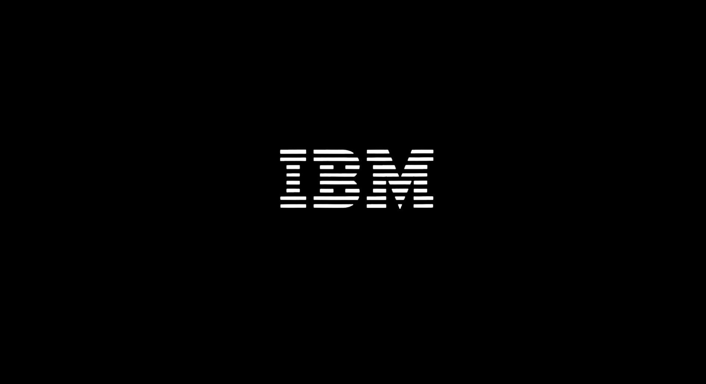
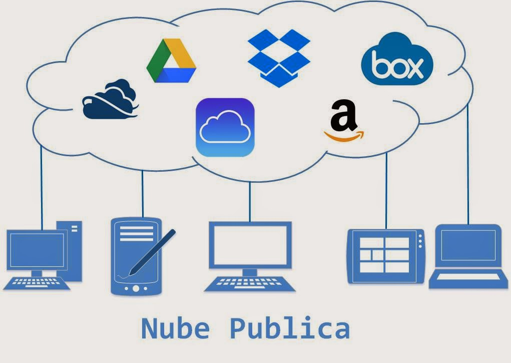

# 🤖**Reto semana uno IA Innovacción Virtual**☁️

## ÍNDICE
* [ ] [👾 La nube, ¿Qué, cuándo y cómo?.](#-La-nube-qué-cuándo-y-cómo)
* [ ] [👾 Servicios de nube.](#-Servicios-de-nube)
* [ ] [👾 Ventajas y desventajas de la nube.](#-Ventajas-y-desventajas-de-la-nube)
* [ ] [👾 Tipos de servicio.](#-Tipos-de-servicio)
* [ ] [👾 Empresas que usan servicios en la nube.](#-Empresas-que-usan-servicios-en-la-nube)
* [ ] [👾 Modelos de servicio en la nube.](#-Modelos-de-servicio-en-la-nube)

## 👾 La nube, ¿Qué, cuándo y cómo?

## 👾 Servicios de nube

### -Amazon WS ☁️:
Amazon Web Services proporciona una plataforma de infraestructura escalable, de confianza y de bajo costo en la nube que impulsa cientos de miles de negocios de 190 países de todo el mundo. Con centros de datos en Estados Unidos, Europa, Brasil, Singapur, Japón y Australia.
[Saber mas de Amazon WS...](https://aws.amazon.com/es/)

### -Azure ☁️:
La nube de Microsoft se presenta como una solución para el campo empresarial que requiere trasladar toda su información tecnológica (sistemas, aplicaciones y software) a la nube, espacios virtuales donde pueden disponer de sus herramientas (con conexión a internet) sin ningún inconveniente.

Microsoft Azure ayuda en la optimización de la gestión de trabajo para implementar y administrar aplicaciones, así como almacenar y analizar bases de datos ágil y eficientemente.
[Saber mas de Azure...](https://azure.microsoft.com/es-mx/free/)

### -Google cloud ☁️:
Google Cloud (Google Cloud) reduce la complejidad y ofrece soluciones que permiten satisfacer tus necesidades de almacenamiento, estadísticas, macrodatos, aprendizaje automático y desarrollo de aplicaciones. Gracias al uso de miles de kilómetros de cable de fibra óptica y a las avanzadas redes definidas por software, la red global de Google ofrece resultados rápidos, coherentes y escalables.
[Saber mas de Google cloud...](https://cloud.google.com/)

### -IBM cloud ☁️:
IBM y VMware han unido fuerzas para simplificar el proceso de desarrollo. Con sus herramientas y tecnología, se puede extender fácilmente las cargas de trabajo VMware de un entorno en local a IBM Cloud de alto rendimiento. Basada en los proyectos de código abierto más populares del mundo, IBM® Cloud es una plataforma cloud que permite a los desarrolladores crear y ejecutar aplicaciones y servicios modernos. Proporciona a los desarrolladores acceso instantáneo a los sistemas y servicios que necesitan: móviles, Internet de las cosas, Watson, etc. 
[Saber mas de IBM cloud...](https://www.ibm.com/mx-es/cloud)

### -Alibaba cloud ☁️:
Alibaba Cloud, también conocida como AliCloud, ofrece una gama de servicios de infraestructura, plataforma y aplicaciones en numerosas áreas. Dichas ofertas incluyen servicios de almacenamiento, red, base de datos, análisis, seguridad y plataforma de aplicaciones.
[Saber mas de Alibaba cloud...](https://us.alibabacloud.com/)

## 👾 Ventajas y desventajas de la nube
**Ventajas**

**Desventajas** 
## 👾 Tipos de servicio

- **Nube híbrida**: Entorno que combina una nube publica y una nube privada, lo que permite compartir datos y aplicaciones entre ellos
        

* **Nube privada**: Los recursos informaticos son de uso exclusico de los usuarios de una empresa u organizaxion la cual se encarga de el consumo de electricidad, seguridad, mantenimiento

    

 + **Nube publica**: Los servicios se ofrecen a traves de la red internet publica y estan disponibles para cualquiera que quiera comprarlas, es decir, conseguir servicios de nube de terceros como Microsoft Azure
        

 

## 👾 Empresas que usan servicios en la nube

**Netflix**: Con la popularización del servicio de Netflix y la gran demanda que comenzaba a tener el servicio, la compañía comenzó a migrar de sus centros de datos tradicionales a servicios en la nube a fin de poder satisfacer la demanda de todos sus suscriptores, lo que permitió por otro lado, una expansión mucho más acelerada, flexible y de menor costo para la compañía. 

**Spotify**: Una de las aplicaciones de reproducción de música más importantes actualmente; utiliza los servicios de la nube para ejecutar la gran demanda de los usuarios suscritos al servicio.

## 👾 Modelos de servicio en la nube

| Modelo | Significado                 | Descripción |
| :---   | :---                        | :---        |
| IaaS   | Infrastructure as a service | Hospedar    |
| PaaS   | Platform as a service       | Construir   |
| SaaS   | Software as a service       | Consumir    |

| Iaas                                  | PaaS                                       | SaaS                                            |
| :---                                  | :---                                       | :---                                            |
| Servicios para arquitectos cloud.     | Plataforma para programadores.             | Software para el usuario final.                 |
| Servidores, networking firewall, etc. | Permite desplegar aplicaciones.            | No se instala, se usa desde el navegador o app. |
| Diseño de la solución a medida.       | No hay que preocuparse de infraestructura. | No se requieren grandes conocimientos técnicos. |