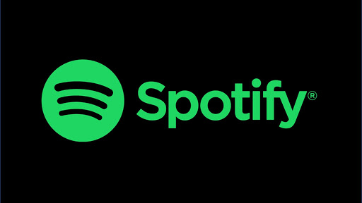

# 🤖**Reto semana uno IA Innovacción Virtual**☁️

## ÍNDICE
* [ ] [👾 La nube, ¿Qué, cuándo y cómo?.](#-La-nube-qué-cuándo-y-cómo)
* [ ] [👾 Servicios de nube.](#-Servicios-de-nube)
* [ ] [👾 Ventajas y desventajas de la nube.](#-Ventajas-y-desventajas-de-la-nube)
* [ ] [👾 Tipos de servicio.](#-Tipos-de-servicio)
* [ ] [👾 Empresas que usan servicios en la nube.](#-Empresas-que-usan-servicios-en-la-nube)
* [ ] [👾 Modelos de servicio en la nube.](#-Modelos-de-servicio-en-la-nube)

## 👾 La nube, ¿Qué, cuándo y cómo?

## 👾 Servicios de nube

### -Amazon WS ☁️:
Amazon Web Services proporciona una plataforma de infraestructura escalable, de confianza y de bajo costo en la nube que impulsa cientos de miles de negocios de 190 países de todo el mundo. Con centros de datos en Estados Unidos, Europa, Brasil, Singapur, Japón y Australia.
[Saber mas de Amazon WS...](https://aws.amazon.com/es/)

### -Azure ☁️:
La nube de Microsoft se presenta como una solución para el campo empresarial que requiere trasladar toda su información tecnológica (sistemas, aplicaciones y software) a la nube, espacios virtuales donde pueden disponer de sus herramientas (con conexión a internet) sin ningún inconveniente.

Microsoft Azure ayuda en la optimización de la gestión de trabajo para implementar y administrar aplicaciones, así como almacenar y analizar bases de datos ágil y eficientemente.
[Saber mas de Azure...](https://azure.microsoft.com/es-mx/free/)

### -Google cloud ☁️:
Google Cloud (Google Cloud) reduce la complejidad y ofrece soluciones que permiten satisfacer tus necesidades de almacenamiento, estadísticas, macrodatos, aprendizaje automático y desarrollo de aplicaciones. Gracias al uso de miles de kilómetros de cable de fibra óptica y a las avanzadas redes definidas por software, la red global de Google ofrece resultados rápidos, coherentes y escalables.
[Saber mas de Google cloud...](https://cloud.google.com/)

### -IBM cloud ☁️:
IBM y VMware han unido fuerzas para simplificar el proceso de desarrollo. Con sus herramientas y tecnología, se puede extender fácilmente las cargas de trabajo VMware de un entorno en local a IBM Cloud de alto rendimiento. Basada en los proyectos de código abierto más populares del mundo, IBM® Cloud es una plataforma cloud que permite a los desarrolladores crear y ejecutar aplicaciones y servicios modernos. Proporciona a los desarrolladores acceso instantáneo a los sistemas y servicios que necesitan: móviles, Internet de las cosas, Watson, etc. 
[Saber mas de IBM cloud...](https://www.ibm.com/mx-es/cloud)

### -Alibaba cloud ☁️:
Alibaba Cloud, también conocida como AliCloud, ofrece una gama de servicios de infraestructura, plataforma y aplicaciones en numerosas áreas. Dichas ofertas incluyen servicios de almacenamiento, red, base de datos, análisis, seguridad y plataforma de aplicaciones.
[Saber mas de Alibaba cloud...](https://us.alibabacloud.com/)

## 👾 Ventajas y desventajas de la nube
**Ventajas**

**Desventajas**

## 👾 Tipos de servicio

- **Nube híbrida**: Entorno que combina una nube publica y una nube privada, lo que permite compartir datos y aplicaciones entre ellos
        

* **Nube privada**: Los recursos informaticos son de uso exclgotusico de los usuarios de una empresa u organizaxion la cual se encarga de el consumo de electricidad, seguridad, mantenimiento

    

 + **Nube publica**: Los servicios se ofrecen a traves de la red internet publica y estan disponibles para cualquiera que quiera comprarlas, es decir, conseguir servicios de nube de terceros como Microsoft Azurel
        

 

## 👾 Empresas que usan servicios en la nube

**Netflix**: Con la popularización del servicio de Netflix y la gran demanda que comenzaba a tener el servicio, la compañía comenzó a migrar degit sus centros de datos tradicionales a servicios en la nube a fin de poder satisfacer la demanda de todos sus suscriptores, lo que permitió por otro lado, una expansión mucho más acelerada, flexible y de menor costo para la compañía. 

**Spotify**: Una de las aplicaciones de reproducción de música más importantes actualmente; utiliza los servicios de la nube para ejecutar la gran demanda de los usuarios suscritos al servicio.

**General Electric:** Es uno de los conglomerados más grandes del mundo, entre las empresas que lo conforman se encuentran instituciones financieras, de tecnología, centros de investigación, entre otros; en 2014 comenzaron una estrategia de transformación digital, para lo cual en 2017, adquirió los servicios de Amazon Web Services para el alojo de más de 2000 aplicaciones y servicios en la nube; este cambio le permitió al conglomerado reorientar sus tareas y recursos hacia acciones de innovación, las cuales no habían podido desarrollar con anterioridad debido a mantener recursos en el mantenimiento de sus centros de datos. 

**Best Day Travel Group:** Es un conglomerado de empresas de turismo mexicana con sede en Cancún, encargada de la gestión de viajes turísticos principalmente; a través de Microsoft Azure, la logró que una de sus empresas lograra ser más eficiente y mucho más escalable, dado que es una empresa de turismo, con sedes tanto en México como en Estados Unidos, la gestión de la demanda debe ser excelente y siempre debe poder soportar los picos de demanda más altos; con la adquisición de servicios de la nube, logró recudir costos pues ya no tenía que gastar en mantenimiento de sus centros de datos, además de que mejoró su calidad del servicio sobre todo en su página web. 

**Mercado libre:** una de la empresas de marketplace más grandes de américa latina logró a través de servicios en las nubes la integración en tiempo real de sus trabajadores y le permitió acotar los tiempo de trabajo, pues más de 1 solo empleado podía trabajar en una misma tarea al mismo tiempo, esto lo logró a través de la integración a través de Google Cloud, la cual a través de diferentes recursos y la compatibilidad con diferentes dispositivos, permitió a la empresa mejorar sus niveles de productividad. 

## 👾 Modelos de servicio en la nube

| Modelo | Significado                 | Descripción |
| :---   | :---                        | :---        |
| IaaS   | Infrastructure as a service | Hospedar    |
| PaaS   | Platform as a service       | Construir   |
| SaaS   | Software as a service       | Consumir    |

| Iaas                                  | PaaS                                       | SaaS                                            |
| :---                                  | :---                                       | :---                                            |
| Servicios para arquitectos cloud.     | Plataforma para programadores.             | Software para el usuario final.                 |
| Servidores, networking firewall, etc. | Permite desplegar aplicaciones.            | No se instala, se usa desde el navegador o app. |
| Diseño de la solución a medida.       | No hay que preocuparse de infraestructura. | No se requieren grandes conocimientos técnicos. |